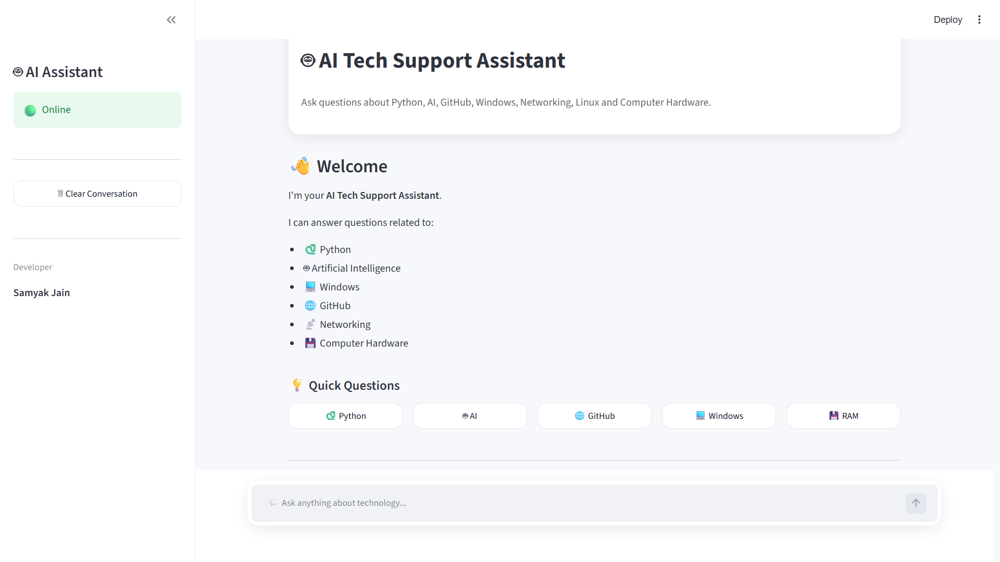

# 🤖 AI Tech Support FAQ Chatbot

An AI-powered FAQ chatbot developed using **Python**, **Streamlit**, **NLTK**, and **Scikit-learn**. The chatbot leverages **Natural Language Processing (NLP)**, **TF-IDF Vectorization**, and **Cosine Similarity** to understand user queries and provide the most relevant answer from a technology-focused knowledge base.

---

## 📌 Features

- 🤖 AI-inspired FAQ chatbot
- 💬 Interactive chat interface
- 🧠 Natural Language Processing (NLP)
- 🔍 TF-IDF Vectorization
- 📊 Cosine Similarity for question matching
- 💡 Quick Question buttons
- 📈 Confidence score for matched responses
- 🧹 Clear conversation option
- 🎨 Modern and responsive Streamlit UI
- ⚡ Fast and lightweight application

---

## 🛠️ Technologies Used

- Python
- Streamlit
- Pandas
- NLTK
- Scikit-learn

---

## 📂 Project Structure

```text
CodeAlpha_FAQChatbot/
│
├── app.py
├── chatbot.py
├── preprocess.py
├── faq.csv
├── requirements.txt
├── README.md
├── .gitignore
└── Screenshots/
    └── chatbot.png
```

---

## 🚀 Installation

### 1. Clone the repository

```bash
git clone https://github.com/Samyak-Jain06/CodeAlpha_FAQChatbot.git
```

### 2. Navigate to the project directory

```bash
cd CodeAlpha_FAQChatbot
```

### 3. Install the required dependencies

```bash
pip install -r requirements.txt
```

### 4. Run the application

```bash
streamlit run app.py
```

---

## 💻 How It Works

1. The user enters a technology-related question.
2. The question is preprocessed using NLP techniques.
3. TF-IDF converts the text into numerical vectors.
4. Cosine Similarity compares the query with the FAQ dataset.
5. The chatbot retrieves the most relevant answer.
6. A confidence score is displayed for the matched response.

---

## 📷 Application Preview



---

## 🎯 Internship Task

This project was developed as part of the **CodeAlpha Artificial Intelligence Internship** to demonstrate the practical implementation of:

- Natural Language Processing (NLP)
- TF-IDF Vectorization
- Cosine Similarity
- Interactive Chatbot Development using Streamlit

---

## 🔮 Future Enhancements

- Larger technology knowledge base
- Voice input support
- Multi-language support
- Database integration
- Chat export functionality
- Dark mode
- AI model integration (Gemini/OpenAI)

---

## 👨‍💻 Developer

**Samyak Jain**

B.Tech Computer Science & Engineering (Artificial Intelligence)

GitHub: https://github.com/Samyak-Jain06

---

## ⭐ Support

If you found this project useful, consider giving it a ⭐ on GitHub.

---

## 📄 License

This project is created for educational and internship purposes.
